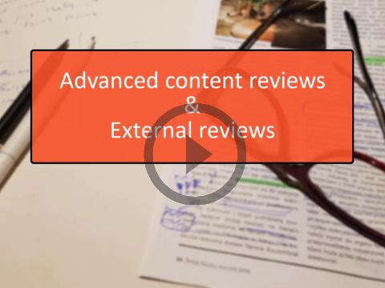
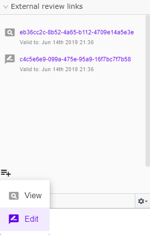
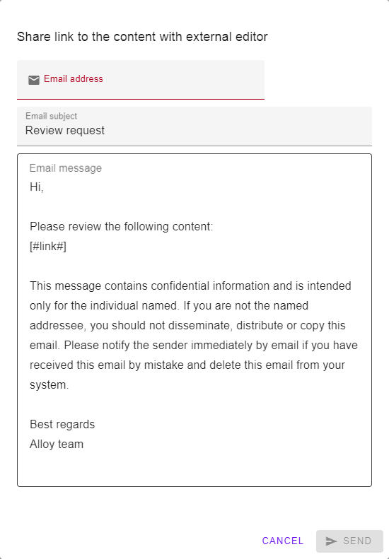
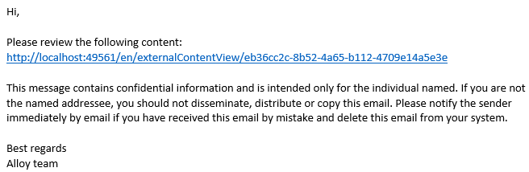

# Advanced Reviews

```
This is an Open Source add-on. Not officially supported by EPiServer.
```

## Highlights

- Context aware smart reviewing 
- Allow external reviewers to access unpublished data
- Provide token-based, expirable links to any content version
- Visually express issues in reviewed content by highlighting or adding screenshots

### See it in action:
[](http://www.youtube.com/watch?v=xb4uS1dXtRE "Advanced Reviews")

## Install

```
Install-Package Advanced.CMS.AdvancedReviews
```

## Development (if you would like to help in development)

```console
$ setup.cmd
$ site.cmd
```

## External reviews

Allow to display draft content version without logging to Episerver.

### External review component
This is an Edit mode component used to generate external review links.
There are two types of links:
* view - external reviewer can preview draft content version 
* editable - external reviewver can add comments using advanced review widget
 


### Share dialog
Editor can share external review links using share dialog.
The [#link#] constant will be replaced with link to content.
 


Below is an email example:



### Security
*/externalContentReviews* location is only accessible to users who are members of the **ExternalReviewers** role.
You will have to manually add personal user accounts or a shared user account that could be used by the external reviews.

### Options
There are few settings related with external review. They are all set using Options class:

 | Option        | Default           | Description  |
 | ---- | ---- | ---- |
 | EmailSubject | [subject email template]|  email subject template |
 | EmailEdit | [email template] |email body template used for readonly content links |
 | EmailView | [email template]| email body template used for editable links |
 | EditableLinksEnabled | false |When true then Editor can create editable links |
 | ViewLinkValidTo | 5 days |For how long view link is valid |
 | EditLinkValidTo | 5 days | For how long editable link is valid |

